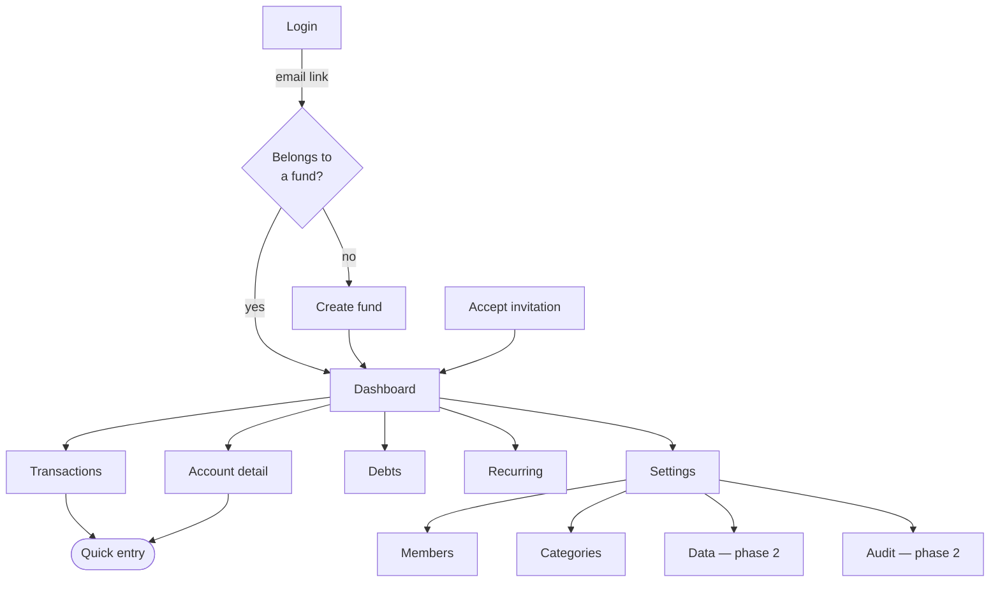
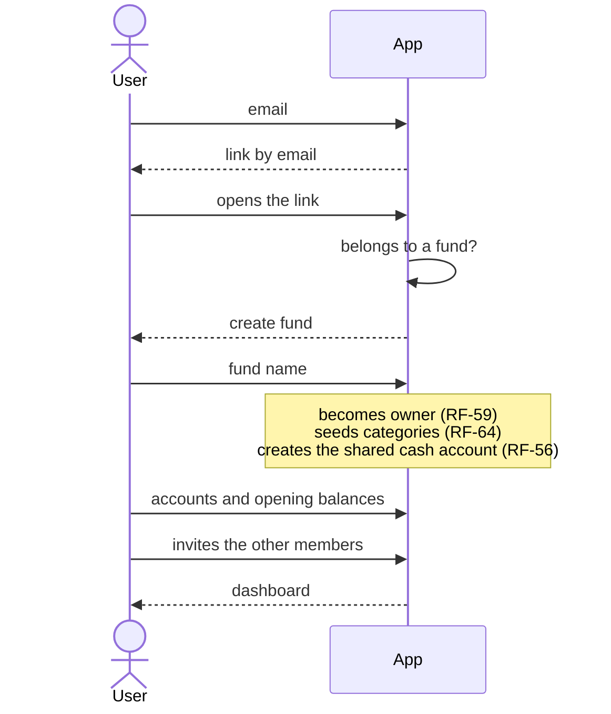
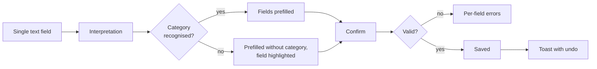
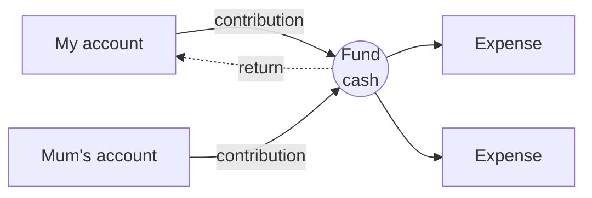
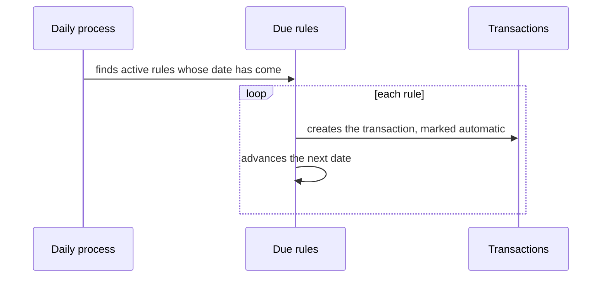
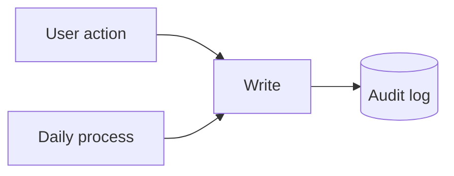
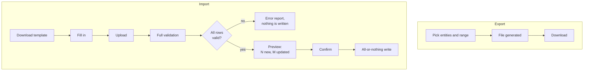

# Shared fund app — flows

Companion to `SPEC.md`. RF and RNF codes refer to section 1 of that document.
This describes what happens and in what order, not how it is built.

---

## 1. Navigation map

Quick entry opens from any screen; it is not a navigation destination. It is the
most frequent action in the app and must not cost a page change.

Anyone belonging to several funds (RF-02) switches from the header, and the
switch applies across the whole application.

---

## 2. First run

What usually goes wrong:

- The opening balance needs its date (RF-10). Without it, any movement predating
  that cutoff throws the calculated balance off.
- Shared accounts are created with no member. There is no need to invent a
  person to hang them on.
- You can create a member and record movements on their behalf before they ever
  open the app. When they accept the invitation they are linked to that existing
  member (RF-06), not given a duplicate.

---

## 3. Quick transaction entry

The flow that decides whether the app survives (RF-22).

What is interpreted is proposed, not imposed: everything stays editable before
saving. The default account is the last one that person used.

The undo toast replaces the confirmation dialog. Confirming every expense is
friction paid fifty times a month; undo gets used once in a while.

---

## 4. Cash

**What is not recorded:** handing someone cash, that person passing it to
another, or who physically carries the notes. None of it changes accounts
(RF-41). That is the entire point of the design: with one cash account per
person, each of those moves would be a transfer nobody is going to log, and
within a week the balances would be fiction.

**Who contributed is settled on the way in, not on the way out.** Withdrawing
from your account into the pot is already your contribution, even though the
money has not been spent yet. If someone else withdraws from your account, it is
still your contribution: it enters the pot and you stop having to track it.

The dashed arrow is the rare case: taking money out of the pot for personal use.
It reduces the contribution of whoever receives it (RF-42).

In the monthly reports:

| Figure | Where it comes from |
|---|---|
| Each member's contribution | Net of transfers into fund accounts |
| Shared spending | Outflows from fund accounts |
| Pot balance | Contributed − spent |

Contributions and spending have no reason to match within a month: the
difference is the cash still sitting there. The report must show them separately
or it will look like a bug.

**Families that prefer personal cash.** There is no setting: if a member has
their own cash account, their withdrawals go there (RF-39). The cost is not in
the model but in the friction, and it is unavoidable — with personal cash,
handing money to someone becomes something a person has to log again.

**Discrepancies.** The real contents of a pocket never match the calculated
balance. Correct it with an expense against an *Unaccounted* category. Because
the pot belongs to the fund and not to a person, that gap is not pinned on
anyone. The number is still useful: it measures how much slips by unrecorded.

---

## 5. Recurring payments

Generated transactions are visually marked and the dashboard reports how many
automatic movements remain unreviewed, until the user confirms them or corrects
the amount (RF-31). Utility bills never arrive at exactly the rule's amount.

These writes land in the audit log identified as system writes (RF-45).

---

## 6. Auditing

Cross-cutting, with no flow of its own: every write is logged by the data layer,
whether it came from a person or from the daily process.

The log distinguishes who wrote each row. A user can never edit or delete it;
the only thing that removes records is the age-based purge (RF-44, RNF-14).

---

## 7. Import and export (phase 2)

To move data from development to production: export, the file already carries
the external references, import. Repeating the operation updates rather than
duplicates (RF-52).

The template offers the existing accounts and categories as valid options.
Without that, someone types a name with a trailing space and half the rows fail.

Import order is dictated by dependencies: members and categories first, then
accounts, then recurring rules and transactions.

---

## 8. Language

The language is visible in the URL (RF-46) and resolved, in order, by what the
URL says, the user's saved preference, the browser's language, and finally
Spanish.

The preference follows the user across all their funds (RF-47). Switching
rewrites the URL and persists the choice.

Amounts are always shown in COP; what changes is the date format and the
thousands separator, not the currency.

Names the user types — accounts, categories, members — are not translated. Only
the categories seeded when the fund is created use the language active at that
moment.

---

## 9. States that need designing

Frequently skipped, and responsible for half the perceived quality:

| State | Where | What to show |
|---|---|---|
| Initial empty | Dashboard with no movements | Guide to creating the first account, not a chart at zero |
| Filtered empty | Filtered list | No results, with an action to clear filters |
| Unreviewed automatics | Dashboard | Notice linking to the already-filtered list |
| Debt without terms | Liability account with no rate or payment | Balance yes, interest no; invitation to complete it |
| Archived member with accounts | Member settings | Ask per account: archive it or hand it to the fund (RF-12) |
| Expired session | Any action | Back to login, preserving the destination |
| Service unavailable | Any query | Explicit error, never a blank screen |

---

## 10. Appearance

The theme is light, dark, or whatever the system asks for (RF-54). It is chosen
from the same header strip as the language, and it is remembered per device: the
same person may read dark on their phone and light on their laptop.

Unlike the language, it does not follow the user between devices, because
"follow the system" is a property of the device.
