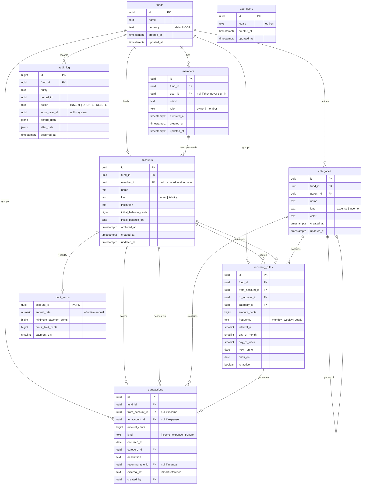

# Shared fund app — specification

> **For the implementing agent:** section 1 is the contract and section 4 fixes
> the stack. If something is not in section 1, it does not get built. This
> document makes no implementation decisions: how each requirement is satisfied
> is decided at implementation time, as long as the non-functional requirements
> hold.

---

## 1. Specification

### Context

Two people keep separate incomes but share household expenses. Today there is no
visibility into where the money goes. The app must provide it with minimal daily
recording effort.

The central unit is the **fund**: a shared pot of money with its own accounts,
members and history. Personal accounts hang off the fund, not the other way
around. The immediate use case is a household, but nothing in the model depends
on that.

Default language: Spanish. Currency: COP. Time zone: `America/Bogota`.

### Scope and phases

**Phase 1 (MVP):** RF-01 through RF-48, and RF-54.

**Phase 2:** RF-49 through RF-53. Import, export and audit viewer. No model
changes required: `external_ref` exists from phase 1 so that importing is
idempotent from day one.

**Out of scope:** bank synchronisation, receipt OCR, multi-currency, budgets with
alerts, accounting exports, native apps. None of this gets built or left
"prepared for".

### Functional requirements

#### Authentication and fund

- [x] **RF-01** — Passwordless email login.
- [x] **RF-02** — A user can belong to several funds; they operate on one at a time and can switch.
- [ ] **RF-03** — Only the `owner` invites members, edits the fund and manages categories.
- [x] **RF-04** — All members of a fund see the same data. There are no partial-read roles.
- [x] **RF-05** — Whoever creates the fund becomes `owner`. The role is transferable, but a fund is never left without an owner.
- [ ] **RF-06** — Accepting an invitation links the user to the member that already exists in the fund, if any; otherwise a member is created.

#### Members and accounts

- [ ] **RF-07** — CRUD for members. A member need not have a user: you record on their behalf even if they never open the app.
- [ ] **RF-08** — CRUD for accounts. Every account belongs to the fund; linking it to a member is optional. Without a member it is a shared account.
- [ ] **RF-09** — An account is either an asset (savings, cash) or a liability (card, loan).
- [ ] **RF-10** — Creating an account captures its opening balance and the date that balance is true as of.
- [ ] **RF-11** — Accounts and members that have movements are archived, not deleted.
- [ ] **RF-12** — Archiving a member does not archive their accounts. The user decides per account: archive it or hand it to the fund.

#### Debts

- [ ] **RF-13** — A liability account may carry an effective annual rate, minimum payment, credit limit and payment day.
- [ ] **RF-14** — The app estimates monthly interest from balance and rate. The annual-to-monthly conversion is effective, not linear.
- [ ] **RF-15** — Consolidated debt view: total balance, summed monthly interest and next payment due.
- [ ] **RF-16** — Paying down a debt is recorded as a transfer from an asset account.

#### Transactions

- [ ] **RF-17** — Record income (destination account only), expense (source account only) or transfer (both).
- [ ] **RF-18** — The type is derived from the accounts involved; the user does not choose it.
- [ ] **RF-19** — Transfers are excluded from every income and expense report.
- [ ] **RF-20** — Every transaction has a positive amount and at least one account.
- [ ] **RF-21** — Both accounts on a transaction always belong to the same fund.
- [ ] **RF-22** — Quick entry: a single text field from which amount, category and description are inferred. Anything inferred stays editable before saving.
- [ ] **RF-23** — Listing with filters by date range, member, account, category and type.
- [ ] **RF-24** — Edit and delete transactions.
- [ ] **RF-25** — Every transaction records which user created it.

#### Categories

- [ ] **RF-26** — CRUD for categories with one level of subcategories. A subcategory belongs to the same fund as its parent.
- [ ] **RF-27** — Each category is either expense or income.
- [x] **RF-28** — Creating a fund seeds an initial category set in the active language.

#### Recurring

- [ ] **RF-29** — CRUD for recurring rules with monthly, weekly or yearly frequency, and the day that matches that frequency.
- [ ] **RF-30** — A daily process turns due rules into real transactions.
- [ ] **RF-31** — Generated transactions are distinguishable from manual ones and are editable: the real amount of a utility bill varies.
- [ ] **RF-32** — A rule can be paused or given an end date without erasing its history.

#### Reports

- [ ] **RF-33** — Dashboard: balance per account, net worth per member, and income, expense and net for the current month.
- [ ] **RF-34** — This month's expenses by category, largest first.
- [ ] **RF-35** — Six-month comparison of income and expense.
- [ ] **RF-36** — Each member's contribution for the month: net of transfers into fund accounts, less those flowing back to that member.
- [ ] **RF-37** — In every report grouped by member, the fund appears as one more group. Shared accounts are not split across people.

#### Cash

- [x] **RF-38** — The fund has a shared cash account, created along with the fund.
- [ ] **RF-39** — A cash withdrawal goes to the member's own cash account if they have one, and to the fund's if they do not. The app neither asks nor stores a mode: the rule is derived from which accounts exist.
- [ ] **RF-40** — Cash expenses come out of the matching cash account. By RF-19 the withdrawal is not an expense, so the amount is never counted twice.
- [ ] **RF-41** — Handing physical cash between people is not recorded: it does not change accounts.
- [ ] **RF-42** — Returning cash to a person is a transfer into one of their accounts and reduces their contribution.

#### Audit

- [ ] **RF-43** — Every creation, change and deletion of fund data is logged with what was touched, by whom, when, and the before and after values.
- [ ] **RF-44** — No user can edit or delete the log. The only permitted removal is the automatic purge in RNF-14.
- [ ] **RF-45** — Capture is automatic and no write can bypass it, including those from the recurring process, which are marked as system writes.

#### Language

- [x] **RF-46** — Interface in Spanish and English, with the language visible in the URL. Spanish by default.
- [x] **RF-47** — The preference belongs to the user and follows them across every fund they belong to.
- [x] **RF-48** — No interface text is hardcoded. Dates and numbers follow the active language; the currency is always COP.

#### Appearance

- [x] **RF-54** — Light theme, dark theme, or follow the system, switchable from the app shell. The choice persists on the device that made it.

#### Import, export and visible audit (phase 2)

- [ ] **RF-49** — Download a spreadsheet template with the expected columns and the existing accounts and categories as valid options.
- [ ] **RF-50** — Export accounts, members, categories, recurring rules and transactions, in the same shape the import accepts.
- [ ] **RF-51** — Import with preview: everything is validated before anything is written, errors are reported per row, and the user confirms. All or nothing.
- [ ] **RF-52** — Re-importing the same file does not duplicate: every row carries a stable external reference and, if it already exists in the fund, it is updated.
- [ ] **RF-53** — Read-only audit log viewer, filterable by entity, user and date range.

### Non-functional requirements

| ID | Requirement |
|---|---|
| RNF-01 | **Zero operating cost.** If a technical decision implies paying, it is discarded. |
| RNF-02 | Fixed stack, the one in section 4. Every library must save a substantial amount of code. |
| RNF-03 | The browser never queries the database directly. Everything goes through the server. |
| RNF-04 | Authorisation is enforced in the database, evaluated against the real session user. Automatic system writes run with their own privileges and are identified as such. |
| RNF-05 | Money is stored as an integer number of cents. Floating point is forbidden. COP formatting exists only in the presentation layer. |
| RNF-06 | Movement dates carry no time and are interpreted in `America/Bogota`. |
| RNF-07 | Balances are derived from movements. They are never stored in a column that has to be kept in sync. |
| RNF-08 | Mobile-first and installable as a PWA. |
| RNF-09 | The dashboard responds in under 2 s with a year of movements loaded. |
| RNF-10 | All input is validated on the server, with the same schema that validates the form. Client-side validation is never sufficient. |
| RNF-11 | The database schema is versioned in migrations. TypeScript types are derived from the schema, never written by hand. |
| RNF-12 | The service cannot go down because of free-tier inactivity. |
| RNF-13 | No data leaves to third parties: no analytics, no bank credentials, no scraping. |
| RNF-14 | The audit log is purged automatically after 24 months. |
| RNF-15 | Import is processed on the server and must work within the free tier's execution limits, in batches if necessary. |

### Retired

Dead codes. The number stays burned and the tick stays as it was.

_None._

---

## 2. Data model

### Invariants

Rules the model must always guarantee, regardless of how they are implemented:

- The fund is the root. Every entity belongs to exactly one fund.
- An account belongs to the fund; the member is optional. Without a member it is
  a shared account. There is no fictional member standing in for the fund.
- A member is a person, with or without a login. Only a member with a user can
  be `owner`.
- A debt is a liability account, not a separate entity. Its balance comes from
  the same calculation as a savings account's.
- A balance is never stored: it derives from the opening balance plus movements.
- Null `from` and `to` define the type: destination only is income, source only
  is expense, both is a transfer. Never both null.
- Both accounts on a transaction belong to the same fund as the transaction.
- The amount is always positive; direction supplies the sign.
- Money is an integer number of cents.
- The audit log cannot be bypassed from any write path.
- `external_ref` is unique within a fund.
- `app_users` hangs off no fund: the language preference belongs to the
  user and follows them across every fund they belong to (RF-47).

---

## 3. Architecture

A Next.js application deployed on Vercel over Supabase (Postgres and
authentication), both on free plans.

Principles, not recipes:

- **The server is the only door to the data.** The client holds no database
  credentials and issues no queries. Pages render on the server and writes go
  through server actions.
- **Authorisation lives in the database.** The server being the only door is not
  enough: access policies are evaluated in Postgres against the real user, so
  that an application bug cannot expose another fund's data.
- **Scheduled work runs inside the database**, not as an external task. Applying
  recurring rules (RF-30) and purging the log (RNF-14) are transactional
  operations and must not depend on an outside service answering; both stay in
  the database. The single exception is the keepalive that holds inactivity off
  (RNF-12): a job inside the database cannot revive a project that is already
  paused, so that one call has to arrive from outside.
- **Auditing is captured in the data layer**, not the application layer. It is
  the only way RF-45 holds.
- **Cost is a design constraint, not an outcome.** Any component that could
  generate a charge is discarded before it is judged on other merits.

---

## 4. Stack

| Need | Choice | What it saves |
|---|---|---|
| ORM and migrations | **Drizzle** | Schema, access policies and types declared once in TypeScript. |
| Auth | **Supabase Auth** | Passwordless login, email delivery, sessions, and the identity the access policies read. |
| Components | **Radix Themes** | Layout, typography, controls and theming as components with props, one stylesheet, no build step. |
| Validation | **Zod** | One schema serves the form, the server and the types. |
| Server actions | **next-safe-action** | Validation, typed errors and loading state on every mutation. |
| Forms | **React Hook Form** | State, errors and submission wired to the validation schema. |
| Table | **TanStack Table** | Sorting, filtering, pagination and selection for the transaction list. |
| Charts | to evaluate | Open: the reports slice (RF-33 to RF-37) picks the library when it builds the first chart. |
| Dates | **date-fns** | Date arithmetic and time zones, tree-shakeable. |
| Toasts | **sonner** | Notifications; Radix Themes ships no toast. |
| Icons | **lucide-react** | An icon set, chosen independently of the component library. |
| Environment | **@t3-oss/env-nextjs** | Fails at build time on a missing variable, not in production. |
| Language | **next-intl** | Locale routing, server-side translations, date and number formatting. |
| Spreadsheets (phase 2) | **ExcelJS** | Reading and writing `.xlsx` with valid options in the template. |

### Do not install

| Library | Use instead |
|---|---|
| Prisma | Drizzle: no binary engine, better cold starts. |
| NextAuth / Auth.js | Supabase Auth: it is where the identity the policies evaluate comes from. |
| rrule | date-fns arithmetic covers monthly, weekly and yearly. |
| Dinero.js | Native browser formatting and integer arithmetic. |
| tRPC | Server actions are already type-safe. |
| Zustand / Redux | State lives on the server. |
| SheetJS `xlsx` | ExcelJS: the npm package has gone years without an update and carries unpatched vulnerabilities. |
| next-i18next | next-intl: the former is tied to the Pages Router. |
| An auditing library | A database trigger. |
| shadcn/ui, Tailwind | Radix Themes. |
